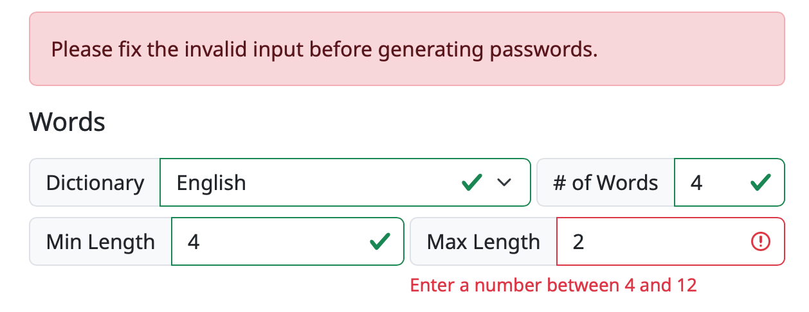

# User Guide

When you first go to [xkpasswd.net](https://xkpasswd.net) while the project is in beta, you'll see an explanation of how this tool is being ported from old and busted Perl code to modern web development languages including JavaScript. You'll be invited to push the "Use the Beta" button to get started. 

If you want to skip this step, go directly to the beta version at [beta.xkpasswd.net](https://beta.xkpasswd.net).

The tool is not yet feature-complete, but what you can use is functioning properly. If any feature is not functioning properly when you visit the tool, you'll see it labeled as such.

### Generate Password(s) with Default Configuration 

If you don't want to fuss around with any kind of settings to generate your passwords, you can simply enter the desired number of passwords and hit the Generate button. By default, this will create 3 highly-complex passwords of the following configuration:

* 3 English words of 4-8 characters in length where each word has a leading capital letter
* Each word is separated by a randomly chosen character but is consistent within each password generated
* 2 digits of padding are on each end of the character-separated words
* 2 random character symbols are added as final padding on either end

For example: `%%85?Fell?Tokyo?Building?74%%`

### Copying passwords

You have two options to copy the passwords. By default, the passwords are shown in a list format with their own individual copy buttons which will copy directly to your clipboard.

The second radio button lets you view the same password list as a block of text that is pre-selected. This view lets you simply use Command/Control-C to copy all of the offered passwords and paste them elsewhere for modification or to let you have a big list of passwords when you're changing several of them at the same time.

## Presets

For ease of use, XKPASSWD comes with a set of predefined presets. Presets can be used as-is, or, they can be used as a starting point for creating your own configuration. 

Note that one of the presets is for security questions. You should never give a real answer to a security question because this is the kind of information that's easy to get in a phishing attack. Think about how easy it would be to find out the city in which you went to high school for example. Instead of answering truthfully, use the `SECURITYQ` preset and store the question and answer in your password manager.

The following presets are defined:

### `APPLEID`

A preset respecting the many prerequisites Apple places on Apple
ID passwords. Apple's official password policy is located here:
[http://support.apple.com/kb/ht4232](http://support.apple.com/kb/ht4232). Note that Apple's knowledgebase article
neglects to mention that passwords can't be longer than 32 characters. This preset
is also configured to use only characters that are easy to type on the standard
iOS keyboard, i.e. those appearing on the letters keyboard (`ABC`) or the
numbers keyboard `.?123`, and not those on the harder-to-reach symbols
keyboard `#+=`. Below is a sample password generated with this preset:

    `@60:london:TAUGHT:forget:70@`

### `DEFAULT`

The default configuration. Below is a sample password generated with this preset:

    `12:settle:SUCCEED:summer:48`

### `NTLM`

A preset for 14-character NTMLv1 (NTLM Version 1) passwords. ONLY USE
THIS PRESET IF YOU MUST! The 14-character limit does not allow for sufficient
entropy in the case where the attacker knows the dictionary and config used
to generate the password, hence this preset will generate low entropy warnings.
Below is a sample password generated with this preset:

    `0=mAYAN=sCART@`

### `SECURITYQ`

A preset for creating fake answers to security questions. It
generates long nonsense sentences ending in `.`, `!` or `?`, for example:

    `Wales outside full month minutes gentle?`

### `TEMPORARY`

A preset for **temporary** use when required to be spoken over the phone. These are **not** secure passwords and should be changed immediately.

### `WEB16`

A preset for websites that don't allow more than 16-character long
passwords. Because 16 characters is not very long, a large set of
symbols are chosen from for the padding and separator. Below is a sample
password generated with this preset:

    `:baby.ohio.DEAR:`

### `WEB32`

A preset for websites that don't allow more than 32-character long
passwords. Below is a sample password generated with this preset:

    `+93-took-CASE-money-AHEAD-31+`

### `WIFI`

A preset for generating 63-character-long WPA2 keys (most routers
allow 64 characters, but some only 63, hence the odd length). Below is a sample
password generated with this preset:

    `2736_ITSELF_PARTIAL_QUICKLY_SCOTLAND_wild_people_7441!!!!!!!!!!`

### `XKCD`

A preset inspired by the original [XKCD comic](http://xkcd.com/936/), but with some alterations to provide sufficient entropy to avoid low entropy warnings. Below is a sample password generated with this preset:

    `KING-madrid-exercise-BELGIUM`

## Settings

The Settings section allows you to tailor passwords to your specifications. Settings reflect the Preset which has been selected. 

### Words

The Words part of Setting is pretty self-explanatory. In the current version, the only Dictionary available is English, but it's on the roadmap to have more dictionaries. You can set the number of words and the minimum and maximum length of the words. The shortest length allowable is 4 characters, while the maximum length is allowable is 12. You can set both min and max to the same value.

_Error thrown if value isn't 4-12 characters_

### Transformations

Including both upper and lower case letters in your password dramatically increases the strength. XKPASSWD allows you six different ways to transform your text, including two that don't use both upper and lower case letters. 

* alternating WORD case
* Capitalise First Letter
* CAPITALISE eVERY IETTER eXCEPT tHe fIRST
* lower case
* UPPER CASE
* EVERY word randomly CAPITALISED or NOT

Note that the last option will not always generate a password with both upper and lower case letters, as it's random whether each word will be capitalized or not.

### Separators

Separators are the special characters that will be placed between the words in your password. These separator characters serve two purposes. They make the password easier to read and remember, and they increase the strength of the password. The password will be stronger because there are more characters to search for to break it, and the password will be longer which means harder to break. You have three options of how to have XKPASSWD to generate your password:

* -none- will put all of the words right up against each other
* Specified Character - a field will be open in which you can type a specific special character you want to use
* Random Character will choose from an alphabet of special characters. **ELABORATE AFTER ALPHABET ERRORS ARE FIXED**

### Padding

Padding refers to digits and symbols added before and after the words in your password. 

First, specify from 0-6 digits (numbers) before and/or after the words.

Next, you can tailor the format of special character symbols that will be repeated before and after the digits.

Choose one of three options for the Type of characters for Padding

* **None** - no special characters will be repeated on either side of the digits 
* **Fixed** - specify the number of symbols before and after the password. You can set these two values to be 0-5 symbols.
* **Adaptive** - in some instances, you may want to create a password that is of a specified length. If you set Type to Adaptive and then specify the length you'd like the complete password to be, XKPASSWD will add enough symbols to make that happen. You can pad the length from 8 to 999 characters. 

Finally, you can set the Padding Type in one of three ways.

* **Separator Character** - consistency throughout your password
* **Specified Character** - allows you to define a specific character to be repeated 
* **Random Character** - lets XKPASSWD choose a character to be repeated
